# Order Processing System

Event-driven order pipeline on **Java 21 + Apache Kafka + Postgres**, built to
demonstrate the V1 → V2 transition that turns a naive at-most-once pipeline
into one with **effectively-once** delivery semantics.

V1 was deliberately broken in five well-known ways. v2.0.0 fixed four of them
(F1–F4) with three mechanisms: an **idempotency key table**, a **transactional
outbox**, and a **dead letter queue**. v2.1.0 closed F5 (consumer lag) with
**virtual-thread parallel batch processing** + **async outbox publish**. v2.2.0
adds **multi-instance fulfillment** — two `fulfillment-service` JVMs share
the broker + Postgres without duplicate publishes, coordinated by
`SELECT FOR UPDATE SKIP LOCKED` on the outbox poll. Each fix is locked in by
a deterministic chaos test (F1–F6) whose assertion was inverted across the
V1 → V2.x commit boundary — that diff is the portfolio artifact.

| | |
|--|--|
| **Spec** | [`spec.md`](./spec.md) — RFC-2119 requirements, V1/V2 mapping |
| **Chaos report** | [`docs/chaos-report.md`](./docs/chaos-report.md) — V1 baseline → V2 fix per failure |
| **Status** | `v2.3.0` released — notification-side idempotency closes the relay-crash duplicate-publish window. All 7 documented failure modes (F1-F7) green in the chaos suite. |

---

## Architecture (V2)

```mermaid
flowchart LR
    client([HTTP client]) -- POST /orders --> api[order-api<br/>Javalin :6080<br/>Idempotency-Key dedup]
    api -- producer --> orders[(orders<br/>Kafka topic)]
    orders -- consume --> ful[fulfillment-service<br/>byte&#91;&#93; deserialize]
    ful -- parse OK --> idemp{processed_orders<br/>idempotency check}
    idemp -- new --> tx[[DB tx:<br/>INSERT processed_orders<br/>+ INSERT outbox]]
    idemp -- seen --> skip[[skip — commit offset]]
    tx --> commit[commitSync offset]
    ful -- parse FAIL --> dlq[(orders.dlq<br/>+ diagnostic headers)]
    relay[outbox-relay thread<br/>idempotent producer] -- poll --> outbox[(outbox table)]
    relay -- publish --> events[(order-events<br/>Kafka topic)]
    relay -- mark published --> outbox
    events --> notif[notification-service<br/>manual commit]
    notif -- log --> stdout([stdout])
    api -.- pg[(Postgres<br/>processed_orders<br/>outbox<br/>idempotency_keys)]
    ful -.- pg
    tx -.-> outbox
    pg --- relay
```



| Service | Stack | Role |
|---------|-------|------|
| `order-api` | Java 21, Javalin, kafka-clients, JDBC | HTTP producer on `:6080`; optional `Idempotency-Key` header for HTTP-layer dedup |
| `fulfillment-service` | Java 21, kafka-clients, Postgres + outbox-relay thread | Idempotent consumer; atomic state + outbox in one DB tx; manual `commitSync` only after tx commits; routes parse failures to DLQ |
| `notification-service` | Java 21, kafka-clients | Consumer with manual commit; logs notifications |
| `kafka` | `apache/kafka:3.8.1` KRaft | Single-node broker, 3 partitions per topic, `auto.create.topics.enable=false` |
| `postgres` | `postgres:16-alpine` | Three Flyway-managed tables: `processed_orders`, `outbox`, `idempotency_keys` |

---

## What broke and how it was fixed

The V1 → V2 story, with the failing chaos test that drove each fix.

| # | V1 bug | Mechanism in V2 | Test (inverted V1 → V2) |
|---|--------|-----------------|------------------------|
| F1 | A client retry on `POST /orders` produced **2** records on `orders` and **2** notifications. | `processed_orders` lookup before any work; `Idempotency-Key` header for HTTP-layer dedup. | `F1_DuplicateOrdersTest` — flipped from `assertEquals(2, …)` to `assertEquals(1, …)`. |
| F2 | A consumer crash before the next auto-commit tick caused **redelivery** → second notification. | `enable.auto.commit=false` + `commitSync` after DB tx; redelivery hits the idempotency check and is skipped. | `F2_DuplicateNotificationsTest` — flipped from 2 → 1. |
| F3 | Auto-commit advanced the offset before work completed → record **lost** on restart. | DB tx is the durability gate; `commitSync` runs only after `COMMIT` succeeds. | `F3_LostOrdersTest` — flipped from `assertEquals(0, …)` to `assertEquals(1, …)`. |
| F4 | Malformed JSON crashed the consumer thread; the partition stalled. | Read as `byte[]`, parse manually; on parse failure, publish raw bytes to `orders.dlq` with diagnostic headers, commit the source offset, continue. | `F4_PoisonMessageTest` — flipped to assert `!consumer.crashed()`, valid event = 1, DLQ size = 1, headers populated. |
| F5 | Single-thread × 50 ms / record → lag grew linearly under burst. | **v2.1.0**: `poll()` batches dispatched onto a virtual-thread executor; per-batch `commitSync`; bounded by `--worker-pool-size` semaphore (default 32); outbox relay moved to async batch publish. | `F5_ConsumerLagTest` — flipped from `assertTrue(lag > 200)` to `assertTrue(lag < 50)`; measured lag = 0 in 2 s window. |
| F6 | (new in v2.2.0 — didn't exist when fulfillment ran in a single JVM) Two relay instances poll the same `WHERE published_at IS NULL` rows → every event published twice. | **v2.2.0**: `SELECT FOR UPDATE SKIP LOCKED` inside an explicit DB tx; the lock is held across the Kafka publish and the `markPublishedBatch` UPDATE so a second instance cannot lock-and-publish the same row. | `F6_MultiInstanceOutboxRaceTest` — spawns two `V2Stack`s sharing broker + Postgres; asserts exactly N events for N orders. |
| F7 | Outbox-relay JVM crashes between successful Kafka publish and `markPublishedBatch` → on restart the row is republished. The idempotent producer dedupes within a session, not across crashes. Pre-v2.3.0 `notification-service` had no idempotency, so customers got two notifications. | **v2.3.0**: `processed_notifications` table; atomic `INSERT ... ON CONFLICT DO NOTHING` before the log emit. Duplicate deliveries lose the conflict and are silently suppressed (`duplicate notification suppressed` log line). | `F7_NotificationDedupTest` — publishes two identical `OrderFulfilled` records to `order-events`; asserts exactly one notification fires. |

Run the suite and watch the numbers come out:

```bash
$ make chaos
[INFO] Tests run: 1, in F1_DuplicateOrdersTest                Time: 4.7s   PASS
[INFO] Tests run: 1, in F2_DuplicateNotificationsTest         Time: 9.0s   PASS
[INFO] Tests run: 1, in F3_LostOrdersTest                     Time: 2.6s   PASS
[INFO] Tests run: 1, in F4_PoisonMessageTest                  Time: 3.8s   PASS
[INFO] Tests run: 1, in F5_ConsumerLagTest                    Time: 3.1s   PASS
[INFO] Tests run: 1, in F6_MultiInstanceOutboxRaceTest        Time: 5.8s   PASS
[INFO] Tests run: 1, in F7_NotificationDedupTest              Time: 3.2s   PASS

=== chaos-test/target/lag-v2.1.txt ===
burst=500 window=2s lag=0
```

For a deeper walkthrough of each test, the V1 baseline numbers, and the actual
DLQ payloads captured during a run, see [`docs/chaos-report.md`](./docs/chaos-report.md).

---

## Why this design

**Outbox vs Kafka native transactions.** Kafka's `initTransactions()` API can
atomically commit producer sends and consumer offsets, but it does so against
Kafka, not against Postgres. As soon as the application has *durable state*
(processed_orders), there's nothing tying that state to the Kafka offset.
DB-backed outbox flips this: the DB transaction is the source of truth, the
relay republishes if it crashes mid-publish, and consumer-side idempotency
absorbs the duplicates. **Kafka becomes at-least-once; correctness lives in
Postgres.**

**In-process relay vs sidecar.** The outbox relay runs as a thread inside the
fulfillment-service JVM, sharing its connection pool. A separate process would
be cleaner architecturally but introduces deployment coupling, leader election,
and an extra failure mode. Kept in-process for V2; revisit if multi-instance
fulfillment becomes necessary.

**Two layers of idempotency.** The `Idempotency-Key` header (HTTP layer) and
`processed_orders` lookup (consumer layer) overlap. Both stay because they
defend against different failure modes: HTTP retries that the broker never
sees vs Kafka redelivery that the order-api never sees. Removing either
opens a duplicate window.

**Straight-to-DLQ on first parse failure.** Production-grade systems retry N
times before giving up. V2 doesn't — a JSON parse failure is structural, not
transient, and infinite retries would still fail. The retry topic is a
v2.3.0 hardening pass.

**Fully-parallel batch processing, not per-key serial.** v2.1.0 dispatches
every record in a `poll()` batch onto a virtual-thread executor with no
ordering constraint. This works because of a **domain insight**: in this
system, records with the same `orderId` are duplicates that the
`processed_orders` idempotency check absorbs, and records with different
`orderId` are independent. There is no per-key serialization requirement.
If the domain ever grows one ("first cancel then place"), the right move
is the [Confluent Parallel Consumer](https://github.com/confluentinc/parallel-consumer)
with `KEY` ordering — not rolling our own per-key locks.

**Atomic claim, not check-then-insert.** With v2.0.0's serial loop, the
fulfillment-service did `SELECT 1 FROM processed_orders` then `INSERT`.
That's a TOCTOU race the moment two workers run in parallel. v2.1.0
collapsed it into a single `INSERT … ON CONFLICT DO NOTHING` that returns
a row count: 1 = "we own this fulfillment, write the outbox row", 0 =
"someone else won, skip". The check IS the insert.

**Multi-instance via `SKIP LOCKED`, not leader election.** v2.2.0 lets the
fulfillment-service scale horizontally. The naive question is "who owns
the outbox?" — leader election with ZooKeeper or etcd is the textbook
answer. We took the simpler path: `SELECT … FOR UPDATE SKIP LOCKED` inside
an explicit DB transaction. Each unpublished row is locked by exactly one
instance's transaction; concurrent pollers `SKIP LOCKED` rows another
instance is holding and pick up disjoint work. Stateless, no coordination
service, no split-brain. The Postgres documentation calls this the
"competing consumers / work queue" pattern. The lock has to be held until
the Kafka publish AND `markPublishedBatch` have committed — releasing it
earlier reopens the duplicate-publish window the whole pattern exists to
close.

**Idempotency at every consumer, not just at the producer.** v2.3.0 closes
the last open V2.x correctness gap: the **relay-crash duplicate-publish
window**. The Kafka idempotent producer dedupes retries within a single
session; it cannot dedupe across a JVM crash that happens after a
successful publish but before the matching `markPublishedBatch` UPDATE
commits. The textbook fix is end-to-end exactly-once via Kafka
transactions, but that requires DB↔Kafka coordination we explicitly
rejected in Q9. The pragmatic fix is **idempotent consumers** —
`notification-service` claims each `orderId` in `processed_notifications`
with the same atomic INSERT-ON-CONFLICT pattern that `fulfillment-service`
uses for `processed_orders`. The duplicate, when it arrives, loses the
conflict and is silently suppressed.

---

## Run it

### Everything in Docker

```bash
make run                                       # docker compose up --build
                                               # brings up: kafka, postgres, order-api,
                                               # notification-service, AND TWO
                                               # fulfillment-service instances
curl -X POST http://localhost:6080/orders \
  -H 'Content-Type: application/json' \
  -d '{"customerId":"alice","items":[{"sku":"SKU-A","quantity":1,"unitPrice":9.99}]}'
# → {"orderId":"<uuid>"}
```

Watch both instances pick up disjoint work:

```bash
docker logs ops-fulfillment-1 2>&1 | grep '"relay published count'
docker logs ops-fulfillment-2 2>&1 | grep '"relay published count'
# Each instance's tick count > 0; sum across both equals total outbox rows.
# Verify no duplicates:
docker exec ops-kafka /opt/kafka/bin/kafka-get-offsets.sh \
  --bootstrap-server localhost:9092 --topic order-events \
  | awk -F: '{sum+=$3} END {print sum}'
# == number of orders POSTed
```

Demonstrate idempotency-key replay:

```bash
KEY=$(uuidgen)
curl -X POST http://localhost:6080/orders -H "Idempotency-Key: $KEY" \
  -H 'Content-Type: application/json' \
  -d '{"customerId":"bob","items":[{"sku":"SKU-B","quantity":1,"unitPrice":4.50}]}'
# → {"orderId":"abc-123"}

# replay — same key, same payload, returns SAME orderId; no Kafka record produced
curl -X POST http://localhost:6080/orders -H "Idempotency-Key: $KEY" \
  -H 'Content-Type: application/json' \
  -d '{"customerId":"bob","items":[{"sku":"SKU-B","quantity":1,"unitPrice":4.50}]}'
# → {"orderId":"abc-123"}
```

Demonstrate the DLQ:

```bash
echo 'not-valid-json' | docker exec -i ops-kafka /opt/kafka/bin/kafka-console-producer.sh \
  --bootstrap-server localhost:9092 --topic orders

make consume-dlq      # poison appears with x-dlq-* headers
docker compose ps     # fulfillment-service still up
```

### Kafka + Postgres in Docker, services on host

```bash
make run-local        # starts kafka + postgres
mvn -DskipTests package
java -jar order-api/target/order-api.jar &
java -jar fulfillment-service/target/fulfillment-service.jar &
java -jar notification-service/target/notification-service.jar &
```

---

## Inspect

```bash
make topics          # list Kafka topics
make consume-orders  # stream the orders topic
make consume-events  # stream order-events
make consume-dlq     # stream orders.dlq with headers
make psql            # interactive Postgres
```

Useful queries against the running Postgres:

```sql
-- fulfilled orders
SELECT order_id, customer_id, fulfilled_at FROM processed_orders ORDER BY fulfilled_at;

-- outbox progress (published_at NULL means relay hasn't sent yet)
SELECT id, topic, published_at IS NOT NULL AS published FROM outbox ORDER BY id;

-- idempotency keys (24 h TTL by convention; not auto-reaped in V2)
SELECT key, order_id, created_at FROM idempotency_keys ORDER BY created_at DESC;
```

---

## Build / test

```bash
make build    # mvn compile
make test     # unit tests only — no broker, ~1s
make chaos    # Testcontainers + Kafka + Postgres, runs F1-F5, ~25s
make package  # shaded jars in each service's target/
make clean    # mvn clean + docker compose down -v
```

The chaos suite is opt-in via the `chaos` Maven profile to keep the
unit-test loop fast.

---

## Project layout

```
order-processing-system/
├── spec.md                         RFC-2119 spec, V1 → V2 mapping
├── docs/chaos-report.md            Detailed V1 baseline vs V2 fix per failure mode
├── docker-compose.yml              kafka + postgres + 3 services
├── Makefile
├── pom.xml                         parent (Java 21, dep management)
├── common/                         shared DTOs, JSON serde, DB helpers, Flyway, TopicAdmin
│   └── src/main/resources/db/migration/   V{1,2,3}__*.sql
├── order-api/                      HTTP → Kafka, Idempotency-Key
├── fulfillment-service/            consumer + outbox relay + DLQ
├── notification-service/           consumer + log
└── chaos-test/                     F1-F5 chaos tests (opt-in, profile=chaos)
```

---

## Roadmap

| Version | Theme | Scope |
|---------|-------|-------|
| `v2.0.0` ✅ | Correctness | F1–F4 fixed via idempotency + outbox + DLQ |
| `v2.1.0` ✅ | Throughput | F5 fixed — virtual-thread parallel batch + async outbox publish; lag 469 → 0 |
| `v2.2.0` ✅ | Multi-instance | F6 fixed — `SELECT FOR UPDATE SKIP LOCKED` lets two fulfillment-service JVMs share the same outbox without duplicate publishes |
| `v2.3.0` ✅ | Hardening | F7 fixed — `processed_notifications` table closes the relay-crash duplicate-publish window |
| `v2.4.0` | Hardening | Retry-before-DLQ — deferred from v2.3.0 (currently no concrete failure mode it would mitigate; revisit when transient downstream calls land) |
| V3 | Architectural shift | Saga pattern (payment → inventory → ship); schema registry + Avro/Protobuf |

---

## Reading

- Kleppmann, *Designing Data-Intensive Applications* — chapters 11–12
- Confluent — *Exactly Once Semantics Are Possible: Here's How Kafka Does It*
- Chris Richardson — *Pattern: Transactional Outbox*, *Pattern: Saga*
- Microsoft — *Asynchronous request-reply / Idempotency Key* docs
