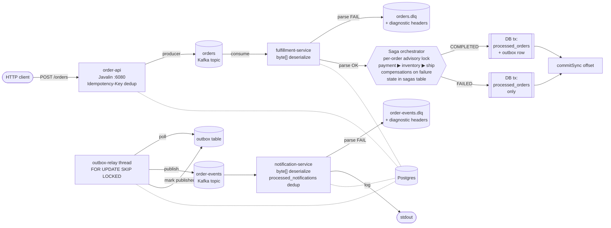

# Order Processing System

Event-driven order pipeline on **Java 21 + Apache Kafka + Postgres**, built
to walk the V1 → V3 evolution: a deliberately-broken naive pipeline; through
the V2.x correctness, throughput, multi-instance, and hardening arc one
minor version at a time; into V3 where fulfillment becomes a **saga state
machine** (payment → inventory → ship) with compensating actions on failure.

The V2.x correctness machinery — idempotency, transactional outbox, DLQ,
multi-instance coordination via `SELECT FOR UPDATE SKIP LOCKED`, notification
dedup — carries over into V3; the saga sits *above* it. v3.1.0 then
hardened the saga against a code review of v3.0.0: four latent defects
(F12–F15) that the original chaos tests were structurally blind to, each
closed by a new test that failed against the old code. Each mechanism was
driven into the codebase by a deterministic chaos test that flipped its
assertion at the version boundary; the diff on those tests is the
portfolio artifact. 16 documented failure modes (F1–F16), all green at
HEAD.

| | |
|--|--|
| **Spec** | [`spec.md`](./spec.md) — RFC-2119 requirements, V1 → v3.1.0 evolution |
| **Chaos report** | [`docs/chaos-report.md`](./docs/chaos-report.md) — per-failure V1 baseline → fix history |
| **Status** | `v3.1.0` released; F16 (transient failure loses an order) found and closed since. All 16 documented failure modes (F1–F16) green in the chaos suite. |

---

## Architecture (V3)



| Service | Stack | Role |
|---------|-------|------|
| `order-api` | Java 21, Javalin, kafka-clients, JDBC | HTTP producer on `:6080`; optional `Idempotency-Key` header with a two-phase (pending → confirmed) lifecycle — a produce failure never poisons a key |
| `fulfillment-service` | Java 21, kafka-clients, Postgres + saga orchestrator + outbox-relay thread | Saga drives payment → inventory → ship with compensations, resumable from any state; per-order advisory lock serializes duplicate deliveries; per-batch `commitSync` after DB tx; parse failures → DLQ; outbox relay coordinates across instances via `SKIP LOCKED` |
| `notification-service` | Java 21, kafka-clients, Postgres | Consumer with manual commit; idempotent log emit via `processed_notifications`; parse failures → `order-events.dlq` |
| `kafka` | `apache/kafka:3.8.1` KRaft | Single-node broker, 4 topics, 3 partitions each, `auto.create.topics.enable=false` |
| `postgres` | `postgres:16-alpine` | Five Flyway-managed tables (V1–V7 migrations): `processed_orders`, `outbox`, `idempotency_keys`, `processed_notifications`, `sagas` |

---

## What broke and how it was fixed

The V1 → V3 story, with the failing chaos test that drove each fix and the
version that landed it.

| # | V1 bug (or new failure mode) | Mechanism (version) | Test (inverted at version boundary) |
|---|------------------------------|--------------------|------------------------------------|
| F1 | A client retry on `POST /orders` produced **2** records on `orders` and **2** notifications. | `processed_orders` lookup before any work; `Idempotency-Key` header for HTTP-layer dedup. | `F1_DuplicateOrdersTest` — flipped from `assertEquals(2, …)` to `assertEquals(1, …)`. |
| F2 | A consumer crash before the next auto-commit tick caused **redelivery** → second notification. | `enable.auto.commit=false` + `commitSync` after DB tx; redelivery hits the idempotency check and is skipped. | `F2_DuplicateNotificationsTest` — flipped from 2 → 1. |
| F3 | Auto-commit advanced the offset before work completed → record **lost** on restart. | DB tx is the durability gate; `commitSync` runs only after `COMMIT` succeeds. | `F3_LostOrdersTest` — flipped from `assertEquals(0, …)` to `assertEquals(1, …)`. |
| F4 | Malformed JSON crashed the consumer thread; the partition stalled. | Read as `byte[]`, parse manually; on parse failure, publish raw bytes to `orders.dlq` with diagnostic headers, commit the source offset, continue. | `F4_PoisonMessageTest` — flipped to assert `!consumer.crashed()`, valid event = 1, DLQ size = 1, headers populated. |
| F5 | Single-thread × 50 ms / record → lag grew linearly under burst. | **v2.1.0**: `poll()` batches dispatched onto a virtual-thread executor; per-batch `commitSync`; bounded by `--worker-pool-size` semaphore (default 32); outbox relay moved to async batch publish. | `F5_ConsumerLagTest` — flipped from `assertTrue(lag > 200)` to `assertTrue(lag < 50)`; measured lag = 0 in 2 s window. |
| F6 | (new in v2.2.0 — didn't exist when fulfillment ran in a single JVM) Two relay instances poll the same `WHERE published_at IS NULL` rows → every event published twice. | **v2.2.0**: `SELECT FOR UPDATE SKIP LOCKED` inside an explicit DB tx; the lock is held across the Kafka publish and the `markPublishedBatch` UPDATE so a second instance cannot lock-and-publish the same row. | `F6_MultiInstanceOutboxRaceTest` — spawns two `V2Stack`s sharing broker + Postgres; asserts exactly N events for N orders. |
| F7 | Outbox-relay JVM crashes between successful Kafka publish and `markPublishedBatch` → on restart the row is republished. The idempotent producer dedupes within a session, not across crashes. Pre-v2.3.0 `notification-service` had no idempotency, so customers got two notifications. | **v2.3.0**: `processed_notifications` table; atomic `INSERT ... ON CONFLICT DO NOTHING` before the log emit. Duplicate deliveries lose the conflict and are silently suppressed (`duplicate notification suppressed` log line). | `F7_NotificationDedupTest` — publishes two identical `OrderFulfilled` records to `order-events`; asserts exactly one notification fires. |
| F8 | (new in v3.0.0 — only exists once fulfillment is multi-step) Payment step fails — the first step of the saga. | **v3.0.0**: saga transitions directly to `FAILED` with `failure_step=payment`; nothing to compensate. `processed_orders` row inserted (idempotency); no outbox row, no notification. | `F8_PaymentFailureNoCompensationTest` |
| F9 | Inventory fails after payment success. Without compensation, the customer would be charged but never receive their order. | **v3.0.0**: orchestrator walks completed steps in reverse — `payment.compensate()` refunds the charge before saga reaches `FAILED`. | `F9_InventoryFailureCompensatesPaymentTest` |
| F10 | Shipping fails after payment + inventory success. | **v3.0.0**: compensations run in reverse order: `inventory.compensate()` releases reserved stock, then `payment.compensate()` refunds. | `F10_ShippingFailureCompensatesAllTest` |
| F11 | Consumer crashes mid-saga on the forward path. | **v3.0.0**: state-aware re-entry — every transition is committed to Postgres before the next step runs, so on redelivery the orchestrator picks up at the next pending step; a step whose completion was committed is never re-executed. | `F11_SagaResumeAfterCrashTest` |
| F12 | (v3.0.0 bug, found in review) Consumer crashes mid-**compensation**. The dispatcher handled only `*_PENDING` states, so a saga redelivered in `COMPENSATING_*` fell through to a bogus `COMPLETED` — a false `OrderFulfilled` for a failed, still-charged order, refund never completed. | **v3.1.0**: exhaustive state dispatch; the compensation chain is resumable from any point; the failure cause is persisted by the transition that *enters* compensation, so the resumed run still knows what failed. | `F12_CompensationResumeAfterCrashTest` — regression guard asserts the resumed result is **not** `COMPLETED`. |
| F13 | (v3.0.0 bug, found in review) Two concurrent deliveries of the same order both read `PAYMENT_PENDING` and both charged — the CAS transitions existed but their results were discarded. Invisible to F1, which counts *events*, not step *executions*. | **v3.1.0**: batch dedupe on (partition, key, value bytes) + a per-order Postgres session advisory lock around the whole saga run + enforced CAS results. Loser blocks, re-reads terminal state, short-circuits. | `F13_ConcurrentSagaDoubleExecutionTest` — two latched threads; `payment.executionCount() == 1` (pre-fix: 2). |
| F14 | (v2.0.0 bug, found in review) `Idempotency-Key` was committed *before* the produce; a produce failure poisoned the key — the client's retry replayed an orderId that never reached Kafka. Lost order, reported as success. | **v3.1.0**: two-phase claim — pending on insert, confirmed on broker ack. A pending replay *re-produces* with the stored orderId; downstream dedup absorbs the duplicate. | `F14_IdempotencyKeyProduceFailureTest` |
| F15 | (V1-class bug, found in review) `notification-service` still deserialized inside the Kafka deserializer — one malformed record on `order-events` killed the consumer and stalled the partition. The F4 lesson, unapplied one topic over. | **v3.1.0**: `byte[]` deserialize + in-loop parse; parse failures → `order-events.dlq` with the standard `x-dlq-*` headers; offset committed, partition keeps moving. | `F15_NotificationPoisonMessageTest` |
| F16 | (v2.1.0 bug, found in a second review) A transient worker failure (DB blip, raw exception out of a step) skipped the batch commit — but the poll position kept advancing, so the next successful batch committed offsets **past** the failed record. Silently lost; "redeliver after rebalance" never came. F3 was blind (it kills the consumer before commit); nothing exercised *survive and keep consuming*. | Failed batch **seeks back** to its first offset per partition (paced) so the very next poll redelivers it — recovery in the same group generation, per OPS-37's replay requirement. Dedupe + idempotency gate + advisory lock absorb the survivors' reprocessing. | `F16_TransientFailureLosesOrderTest` — red at pre-fix HEAD: follower order fulfilled, victim never landed. |

Run the suite and watch the numbers come out:

```bash
$ make chaos
[INFO] Tests run: 1, in F1_DuplicateOrdersTest                Time: 4.7s   PASS
[INFO] Tests run: 1, in F2_DuplicateNotificationsTest         Time: 5.6s   PASS
[INFO] Tests run: 1, in F3_LostOrdersTest                     Time: 2.7s   PASS
[INFO] Tests run: 1, in F4_PoisonMessageTest                  Time: 3.7s   PASS
[INFO] Tests run: 1, in F5_ConsumerLagTest                    Time: 2.7s   PASS
[INFO] Tests run: 1, in F6_MultiInstanceOutboxRaceTest        Time: 5.8s   PASS
[INFO] Tests run: 1, in F7_NotificationDedupTest              Time: 3.1s   PASS
[INFO] Tests run: 1, in F8_PaymentFailureNoCompensationTest   Time: 0.1s   PASS
[INFO] Tests run: 1, in F9_InventoryFailureCompensatesPay…    Time: 3.7s   PASS
[INFO] Tests run: 1, in F10_ShippingFailureCompensatesAllT…   Time: 0.1s   PASS
[INFO] Tests run: 1, in F11_SagaResumeAfterCrashTest          Time: 0.1s   PASS
[INFO] Tests run: 3, in F12_CompensationResumeAfterCrashTest   Time: 0.4s   PASS
[INFO] Tests run: 2, in F13_ConcurrentSagaDoubleExecutionTest  Time: 0.2s   PASS
[INFO] Tests run: 1, in F14_IdempotencyKeyProduceFailureTest   Time: 5.3s   PASS
[INFO] Tests run: 1, in F15_NotificationPoisonMessageTest      Time: 1.7s   PASS
[INFO] Tests run: 1, in F16_TransientFailureLosesOrderTest      Time: 4.6s   PASS

=== chaos-test/target/lag-v2.1.txt ===
burst=500 window=2s lag=0
```

For a deeper walkthrough of each test, the V1 baseline numbers, and the actual
DLQ payloads captured during a run, see [`docs/chaos-report.md`](./docs/chaos-report.md).

---

## Why this design

**Outbox vs Kafka native transactions.** Kafka's `initTransactions()` API can
atomically commit producer sends and consumer offsets, but it does so against
Kafka, not against Postgres. As soon as the application has *durable state*
(processed_orders), there's nothing tying that state to the Kafka offset.
DB-backed outbox flips this: the DB transaction is the source of truth, the
relay republishes if it crashes mid-publish, and consumer-side idempotency
absorbs the duplicates. **Kafka becomes at-least-once; correctness lives in
Postgres.**

**In-process relay vs sidecar.** The outbox relay runs as a thread inside the
fulfillment-service JVM, sharing its connection pool. A separate process would
be cleaner architecturally but introduces deployment coupling, leader election,
and an extra failure mode. Multi-instance horizontal scaling landed in v2.2.0
without splitting the relay into a sidecar — `SELECT FOR UPDATE SKIP LOCKED`
on the outbox poll lets multiple in-process relays coordinate via the DB.

**Two layers of idempotency.** The `Idempotency-Key` header (HTTP layer) and
`processed_orders` lookup (consumer layer) overlap. Both stay because they
defend against different failure modes: HTTP retries that the broker never
sees vs Kafka redelivery that the order-api never sees. Removing either
opens a duplicate window. v3.1.0 made the HTTP layer honest about produce
failures: a key is *claimed* before the produce but *confirmed* only after
the broker ack, so a 500'd request leaves the key pending and the retry
re-produces with the same orderId instead of replaying an orderId that
never reached Kafka (F14).

**Straight-to-DLQ on first parse failure.** Production-grade systems retry N
times before giving up. We don't — a JSON parse failure is structural, not
transient, and infinite retries would still fail. Retry-before-DLQ was
originally targeted for v2.3.0, then deferred (no transient-error path in
the pipeline yet); V3.0.0 sagas introduce real retryable calls, so v3.1.0
will revisit retry topics layered on the saga steps where it actually buys
something.

**Parallel across keys, serialized within a key.** v2.1.0 dispatches every
record in a `poll()` batch onto a virtual-thread executor, justified by a
domain insight: same-`orderId` records are duplicates the idempotency check
absorbs; different-`orderId` records are independent. The second half is
still true. The first half quietly stopped being true at v3.0.0 — saga
steps have side effects that run *before* the idempotency claim, so two
concurrent duplicates could both charge the customer (F13). v3.1.0 keeps
the cross-key parallelism (the part that fixes F5) and serializes within a
key: exact duplicates are deduped inside the batch, and every saga run
holds a per-order Postgres session advisory lock, so the second delivery
blocks briefly and short-circuits on the winner's terminal state. The lock
rides the same connection as the saga's state transitions — one connection
per in-flight saga, which is why the pool is sized past the worker
semaphore. If the domain ever grows a real ordering requirement ("first
cancel then place"), the right move is still the
[Confluent Parallel Consumer](https://github.com/confluentinc/parallel-consumer)
with `KEY` ordering — not more homegrown locks.

**Atomic claim, not check-then-insert.** With v2.0.0's serial loop, the
fulfillment-service did `SELECT 1 FROM processed_orders` then `INSERT`.
That's a TOCTOU race the moment two workers run in parallel. v2.1.0
collapsed it into a single `INSERT … ON CONFLICT DO NOTHING` that returns
a row count: 1 = "we own this fulfillment, write the outbox row", 0 =
"someone else won, skip". The check IS the insert.

**Multi-instance via `SKIP LOCKED`, not leader election.** v2.2.0 lets the
fulfillment-service scale horizontally. The naive question is "who owns
the outbox?" — leader election with ZooKeeper or etcd is the textbook
answer. We took the simpler path: `SELECT … FOR UPDATE SKIP LOCKED` inside
an explicit DB transaction. Each unpublished row is locked by exactly one
instance's transaction; concurrent pollers `SKIP LOCKED` rows another
instance is holding and pick up disjoint work. Stateless, no coordination
service, no split-brain. The Postgres documentation calls this the
"competing consumers / work queue" pattern. The lock has to be held until
the Kafka publish AND `markPublishedBatch` have committed — releasing it
earlier reopens the duplicate-publish window the whole pattern exists to
close.

**Idempotency at every consumer, not just at the producer.** v2.3.0 closes
the last open V2.x correctness gap: the **relay-crash duplicate-publish
window**. The Kafka idempotent producer dedupes retries within a single
session; it cannot dedupe across a JVM crash that happens after a
successful publish but before the matching `markPublishedBatch` UPDATE
commits. The textbook fix is end-to-end exactly-once via Kafka
transactions, but that requires DB↔Kafka coordination we explicitly
rejected in Q9. The pragmatic fix is **idempotent consumers** —
`notification-service` claims each `orderId` in `processed_notifications`
with the same atomic INSERT-ON-CONFLICT pattern that `fulfillment-service`
uses for `processed_orders`. The duplicate, when it arrives, loses the
conflict and is silently suppressed.

**Saga as a persisted state machine, not a transaction.** V3.0.0
introduces the saga pattern. Three steps (payment → inventory → ship)
each can fail; failures must compensate already-completed steps in
reverse order. The orchestrator commits every state transition to
Postgres *before* invoking the next step, which buys two important
properties: (1) on JVM crash + redelivery, the orchestrator reads the
saga's persisted state and picks up where it left off — on the forward
path (F11) *and*, since v3.1.0, mid-compensation (F12), with the failure
cause persisted at compensation entry so the resumed run can still report
it; (2) the *orchestration state* is durable. (The step *effects* are
simulated in-memory per the spec — which is exactly why compensations are
required to be idempotent (OPS-225) and why v3.2.0's real external calls
need per-step idempotency keys.) The trade-offs: each step adds a DB
round-trip; each in-flight saga holds a pooled connection for its run
(the per-order lock); a step re-runs if the JVM dies between its
`execute()` returning and the transition committing; and compensations
that themselves *fail* still just retry via redelivery — budgets and
alerting are v3.2.0 work. Real distributed sagas (separate services per
step over Kafka request/response) fit cleanly on top of this state
machine — v3.3.0.

---

## Run it

### Everything in Docker

```bash
make run                                       # docker compose up --build
                                               # brings up: kafka, postgres, order-api,
                                               # notification-service, AND TWO
                                               # fulfillment-service instances
curl -X POST http://localhost:6080/orders \
  -H 'Content-Type: application/json' \
  -d '{"customerId":"alice","items":[{"sku":"SKU-A","quantity":1,"unitPrice":9.99}]}'
# → {"orderId":"<uuid>"}
```

Watch both instances pick up disjoint work:

```bash
docker logs ops-fulfillment-1 2>&1 | grep '"relay published count'
docker logs ops-fulfillment-2 2>&1 | grep '"relay published count'
# Each instance's tick count > 0; sum across both equals total outbox rows.
# Verify no duplicates:
docker exec ops-kafka /opt/kafka/bin/kafka-get-offsets.sh \
  --bootstrap-server localhost:9092 --topic order-events \
  | awk -F: '{sum+=$3} END {print sum}'
# == number of orders POSTed
```

Demonstrate idempotency-key replay:

```bash
KEY=$(uuidgen)
curl -X POST http://localhost:6080/orders -H "Idempotency-Key: $KEY" \
  -H 'Content-Type: application/json' \
  -d '{"customerId":"bob","items":[{"sku":"SKU-B","quantity":1,"unitPrice":4.50}]}'
# → {"orderId":"abc-123"}

# replay — same key, same payload, returns SAME orderId; no Kafka record produced
curl -X POST http://localhost:6080/orders -H "Idempotency-Key: $KEY" \
  -H 'Content-Type: application/json' \
  -d '{"customerId":"bob","items":[{"sku":"SKU-B","quantity":1,"unitPrice":4.50}]}'
# → {"orderId":"abc-123"}
```

Demonstrate the DLQ:

```bash
echo 'not-valid-json' | docker exec -i ops-kafka /opt/kafka/bin/kafka-console-producer.sh \
  --bootstrap-server localhost:9092 --topic orders

make consume-dlq      # poison appears with x-dlq-* headers
docker compose ps     # fulfillment-service still up
```

### Kafka + Postgres in Docker, services on host

```bash
make run-local        # starts kafka + postgres
mvn -DskipTests package
# Postgres is published on host port 6432 (the compose mapping avoids
# clashing with a host Postgres), so host-run services need an explicit URL:
JDBC=jdbc:postgresql://localhost:6432/orders
java -jar order-api/target/order-api.jar                       --jdbc-url $JDBC &
java -jar fulfillment-service/target/fulfillment-service.jar   --jdbc-url $JDBC &
java -jar notification-service/target/notification-service.jar --jdbc-url $JDBC &
```

---

## Inspect

```bash
make topics          # list Kafka topics
make consume-orders  # stream the orders topic
make consume-events  # stream order-events
make consume-dlq     # stream orders.dlq with headers
make psql            # interactive Postgres
```

Useful queries against the running Postgres:

```sql
-- fulfilled orders (v3.1.0: failed sagas are also recorded here, as status='FAILED')
SELECT order_id, customer_id, fulfilled_at FROM processed_orders
WHERE status = 'FULFILLED' ORDER BY fulfilled_at;

-- failed orders, joined to what step failed
SELECT p.order_id, s.failure_step, s.failure_reason FROM processed_orders p
JOIN sagas s USING (order_id) WHERE p.status = 'FAILED';

-- outbox progress (published_at NULL means relay hasn't sent yet)
SELECT id, topic, published_at IS NOT NULL AS published FROM outbox ORDER BY id;

-- idempotency keys (24 h TTL by convention; not auto-reaped)
-- confirmed_at NULL = claimed but produce never acked (retry will re-produce)
SELECT key, order_id, created_at, confirmed_at FROM idempotency_keys ORDER BY created_at DESC;

-- saga state (V3) — see what step each order reached and what failed
SELECT order_id, state, failure_step, failure_reason FROM sagas ORDER BY updated_at DESC;
```

---

## Build / test

```bash
make build    # mvn compile
make test     # unit tests only — no broker, ~1s
make chaos    # Testcontainers + Kafka + Postgres, runs F1-F16, ~60s
make package  # shaded jars in each service's target/
make clean    # mvn clean + docker compose down -v
```

The chaos suite is opt-in via the `chaos` Maven profile to keep the
unit-test loop fast.

---

## Project layout

```
order-processing-system/
├── spec.md                         RFC-2119 spec, V1 → V3 evolution
├── docs/chaos-report.md            Per-failure V1 baseline → fix history
├── docker-compose.yml              kafka + postgres + 4 service containers
├── Makefile
├── pom.xml                         parent (Java 21, dep management)
├── common/                         shared DTOs, JSON serde, DB helpers, Flyway, TopicAdmin
│   └── src/main/resources/db/migration/   V1..V7 SQL migrations
├── order-api/                      HTTP → Kafka, Idempotency-Key store
├── fulfillment-service/            saga orchestrator + outbox relay + DLQ
│   └── src/main/java/.../saga/    SagaState, SagaStep, *Step impls, SagaStore, SagaOrchestrator
├── notification-service/           consumer + log + processed_notifications dedup + order-events.dlq
└── chaos-test/                     F1-F16 chaos tests (opt-in, profile=chaos)
```

---

## Roadmap

Shipped:

| Version | Theme | Scope |
|---------|-------|-------|
| `v1.0.0` ✅ | Naive baseline | Three-service pipeline; auto-commit; in-memory state; no idempotency, no DLQ, no outbox. F1–F5 deliberately broken. |
| `v2.0.0` ✅ | Correctness | F1–F4 fixed: `processed_orders` idempotency, transactional outbox, DLQ for poison, manual `commitSync` after DB tx |
| `v2.1.0` ✅ | Throughput | F5 fixed — virtual-thread parallel batch + async outbox publish; lag 469 → 0 |
| `v2.2.0` ✅ | Multi-instance | F6 fixed — `SELECT FOR UPDATE SKIP LOCKED` lets multiple `fulfillment-service` JVMs share the same outbox without duplicate publishes |
| `v2.3.0` ✅ | Hardening | F7 fixed — `processed_notifications` table closes the relay-crash duplicate-publish window |
| `v3.0.0` ✅ | Architectural shift | Saga pattern (payment → inventory → ship) with compensating actions; F8–F11 chaos coverage |
| `v3.1.0` ✅ | Review hardening | F12–F15 fixed: resumable compensation, per-order serialization (advisory lock + enforced CAS + batch dedupe), two-phase `Idempotency-Key`, `order-events.dlq`; failed-saga row shape (`processed_orders.status`); `make run-local` repaired; spec reconciled (Q32–Q35) |

Open / future:

| Version | Theme | Scope |
|---------|-------|-------|
| `v3.2.0` | Saga step reality | Per-step bounded retries with backoff; compensation-failure handling with retry + alerting; per-step idempotency keys (`orderId + step.name`) closing the execute-vs-commit re-run window (OPS-224); `OrderFailed` event topic; notification-side outbox (OQ-1) |
| `v3.3.0` | Real distributed sagas | Split payment / inventory / shipping into separate services; orchestrator drives them via Kafka request/response |
| `v3.4.0+` | Choose-your-own | Schema registry + Avro/Protobuf; OpenTelemetry tracing across the saga; Prometheus metrics; saga-state Grafana dashboard |

---

## Reading

- Kleppmann, *Designing Data-Intensive Applications* — chapters 11–12
- Confluent — *Exactly Once Semantics Are Possible: Here's How Kafka Does It*
- Chris Richardson — *Pattern: Transactional Outbox*, *Pattern: Saga*
- Microsoft — *Asynchronous request-reply / Idempotency Key* docs
